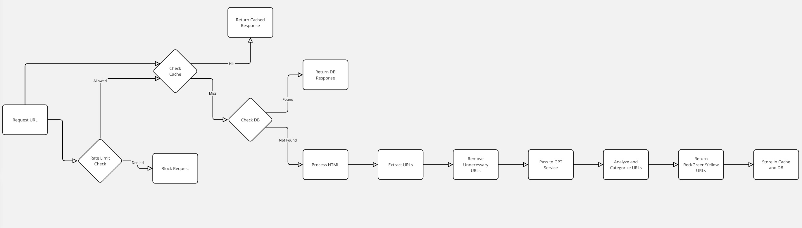

# Project Setup Guide

This guide provides step-by-step instructions to set up and manage your Python project, including initializing a Git repository, setting up a virtual environment, creating a `requirements.txt` file, and configuring environment variables.

## Prerequisites

- Python installed on your system.
- Git installed on your system.
- A text editor or IDE (e.g., Visual Studio Code).

## Project Setup

1. **Create and Navigate to Your Project Directory**

    ```sh
    mkdir my_project
    cd my_project
    ```

2. **Initialize a Git Repository**

    ```sh
    git init
    ```

3. **Set Up a Virtual Environment**

    Create and activate a virtual environment:

    ```sh
    python -m venv venv
    source venv/bin/activate  # On Windows, use `venv\Scripts\activate`
    ```

4. **Install Project Dependencies**

    Install the required packages using `pip`:

    ```sh
    pip install django
    pip install python-dotenv
    pip install openai
    ```

5. **Create `requirements.txt`**

    Generate a `requirements.txt` file that lists all the installed packages and their versions:

    ```sh
    pip freeze > requirements.txt
    ```

6. **Create a `.env` File**

    Create a `.env` file in the root of your project to store environment variables:

    ```sh
    touch .env
    ```

    Add your OpenAI API key to the `.env` file:

    ```env
    OPENAI_API_KEY=your_openai_api_key_here
    ```


## Running the Application

With this setup, your application will load the API key from the `.env` file when it starts. Make sure to keep your `.env` file secure and not share it publicly.

To run your application, ensure your virtual environment is activated:

```sh
source venv/bin/activate  # On Windows, use `venv\Scripts\activate`
